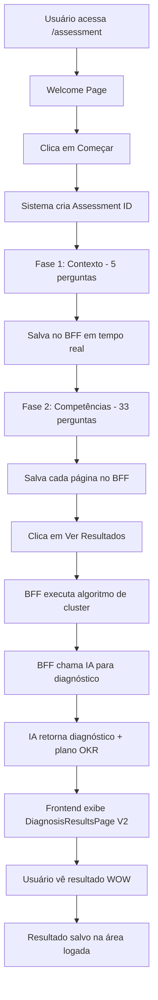

# 🎯 Como Funciona o Assessment da MoverseMais

## 📋 Visão Geral para Leigos

O assessment da MoverseMais é uma ferramenta que ajuda líderes de tecnologia a descobrirem qual habilidade de liderança eles devem desenvolver primeiro para gerar o maior impacto em sua carreira e equipe.

**Tempo total**: ~15 minutos  
**Resultado**: Diagnóstico personalizado + Plano de ação de 30 dias

---

## 🎬 A Jornada Completa do Usuário

### **Fase 1: Boas-Vindas (30 segundos)**

**O que o usuário vê:**
- Página de apresentação elegante com fundo escuro e gradientes
- Título: "Descubra sua Habilidade-Chave"
- Explicação do processo (5 min contexto + 33 situações práticas + relatório)
- Botão grande e chamativo: "Descobrir Minha Próxima Habilidade"

**O que acontece por trás:**
- Sistema prepara conexão com servidor (BFF GraphQL)
- Cria ID único para este assessment específico
- Carrega perguntas do banco de dados
- Inicia cronômetro interno (métricas de engajamento)

**Objetivo desta fase:**
- Deixar o usuário confortável e motivado
- Explicar claramente o que vai acontecer
- Criar expectativa positiva

---

### **Fase 2: Contexto Profissional (5 minutos)**

**O que o usuário vê:**
- 5 perguntas sobre seu momento atual:
  1. **Tempo de liderança**: Há quanto tempo lidera? (Menos de 1 ano / 1-3 anos / 3-5 anos / Mais de 5 anos)
  2. **Tamanho da equipe**: Quantas pessoas lidera? (1-5 / 6-10 / 11-20 / Mais de 20)
  3. **Tipo de empresa**: Qual tipo de empresa? (Startup / Scaleup / Established / Enterprise)
  4. **Pressões atuais**: Quais são suas maiores pressões? (Múltipla escolha, máx 2)
  5. **Como está se sentindo**: Como se sente como líder? (Opções emocionais)

**Como funciona:**
- Cards grandes e visuais
- Botões de rádio estilizados (não checkboxes feios)
- Validação: não pode avançar sem responder
- Barra de progresso mostrando "Etapa 1 de 3"
- Botões "Anterior" e "Próxima" sempre visíveis

**O que acontece por trás:**
- Cada resposta é salva instantaneamente no servidor
- Sistema analisa o contexto para personalizar próximas etapas
- Validação: pergunta de "pressões" aceita no máximo 2 opções
- ID do assessment é preservado em memória

**Objetivo desta fase:**
- Entender o momento de vida do líder
- Personalizar a análise futura
- Criar contexto para o diagnóstico AI

---

### **Fase 3: Mapeamento de Competências (10 minutos)**

**O que o usuário vê:**
- 33 situações práticas do dia a dia de um líder técnico
- Cada situação tem 5 opções de resposta (escala Likert):
  - 1 = Nunca faço / Não se aplica
  - 2 = Raramente / Com muita dificuldade
  - 3 = Às vezes / Com alguma dificuldade
  - 4 = Frequentemente / Com facilidade
  - 5 = Sempre / Naturalmente

**Exemplos de situações (reais):**
- "Delego tarefas importantes para membros da equipe"
- "Dou feedback construtivo de forma regular"
- "Priorizo as demandas da equipe de forma clara"
- "Gerencio dívida técnica de forma estruturada"
- "Comunico decisões técnicas para stakeholders não-técnicos"

**Como funciona:**
- Perguntas divididas em **3 páginas** de ~11 perguntas cada
- Escala visual com círculos coloridos (1 a 5)
- Barra de progresso: "Página 1 de 3" → "Página 2 de 3" → "Página 3 de 3"
- Botão "Próxima Página" só ativa quando todas as perguntas da página são respondidas
- Última página mostra "Ver Resultados" com efeito de loading

**O que acontece por trás:**
- Cada resposta é salva no servidor em tempo real
- Sistema agrupa perguntas por competência (ex: 3 perguntas sobre "Delegação")
- Algoritmo calcula score médio de cada competência
- AI analisa padrões nas respostas
- Identifica gaps e oportunidades

**Objetivo desta fase:**
- Mapear comportamentos reais, não teóricos
- Identificar força e fraqueza em 11 competências
- Gerar dados para algoritmo de clustering

**As 11 competências mapeadas:**
1. Delegação e Autonomia
2. Feedback e Desenvolvimento
3. Comunicação Técnica
4. Gestão de Prioridades
5. Visão Estratégica
6. Gestão de Conflitos
7. Tomada de Decisão
8. Formação de Equipes
9. Gestão de Dívida Técnica
10. Adaptabilidade
11. Autoconhecimento

---

### **Fase 4: Processamento Inteligente (10-15 segundos)**

**O que o usuário vê:**
- Botão "Ver Resultados" mostra spinner/loading
- Mensagem: "Processando suas respostas..."
- Animação suave indicando trabalho em andamento

**O que acontece por trás (a mágica!):**

#### **Passo 1: Análise de Clusters**
- Algoritmo agrupa suas respostas por competência
- Calcula score médio de cada uma (1-5)
- Identifica qual competência tem:
  - **Maior gap** (diferença entre seu nível e o ideal)
  - **Maior impacto potencial** (se desenvolvida)
  - **Maior probabilidade de sucesso**

#### **Passo 2: Contextualização**
- Cruza suas respostas com seu contexto profissional
- Exemplo: Se você é líder há menos de 1 ano + equipe pequena + startup
  - Prioridade: "Delegação" (crítico para escalar)
- Exemplo: Se você é líder experiente + equipe grande + empresa estabelecida
  - Prioridade: "Visão Estratégica" (crítico para impacto)

#### **Passo 3: Diagnóstico AI (V2 - Novo!)**
Sistema envia para **IA Generativa (GPT-4)**:
- Suas 38 respostas completas
- Seu contexto profissional
- A competência prioritária identificada
- Padrões comportamentais detectados

**A IA retorna:**
- **Criticidade**: Moderado / Alto / Crítico (🟢🟡🔴)
- **Estado Atual**: Descrição empática de onde você está
  - Exemplo: "Você está sobrecarregado, com múltiplas frentes e sensação de falta de tempo"
- **Estado Desejado**: Visão motivadora de onde você pode chegar
  - Exemplo: "Ter clareza sobre prioridades e tempo para focar no que realmente importa"
- **Explicação Personalizada**: Por que essa competência foi escolhida para VOCÊ
  - Exemplo: "Com base nas suas respostas, identificamos que Gestão de Prioridades tem o maior potencial de impactar positivamente seus resultados. Você demonstrou força em delegação, mas dificuldade em decidir o que é realmente prioritário."

#### **Passo 4: Plano OKR Personalizado**
A IA gera um **plano de ação de 30 dias** estruturado em OKR:

**Objetivo** (O):
- Exemplo: "Estabilizar gestão de prioridades e ganhar clareza"

**Key Results** (KRs) - 3 ações práticas:
1. **KR1** (Semana 1): "Mapear todas as demandas atuais e classificar por urgência/impacto"
   - 📊 Métrica: Lista documentada com matriz 2x2
   - ⏰ Prazo: 1 semana
   - ⭐ Prioridade: Alta

2. **KR2** (Semanas 2-3): "Definir ritual semanal de revisão de prioridades"
   - 📊 Métrica: Ritual documentado e testado 2x
   - ⏰ Prazo: 2 semanas
   - ⭐⭐ Prioridade: Muito Alta

3. **KR3** (Semana 4): "Comunicar prioridades para equipe e stakeholders"
   - 📊 Métrica: Reunião de alinhamento realizada
   - ⏰ Prazo: 4 semanas
   - ⭐ Prioridade: Alta

**Confiança da IA**: 85% (barra visual animada)
**Timeline**: 1 mês

---

### **Fase 5: Resultado Visual (WOW Moment!)**

**O que o usuário vê - Design EXCEPCIONAL:**

#### **1. Hero Section - Impacto Visual**
```
┌─────────────────────────────────────────────┐
│   ✓ (Ícone grande verde animado)            │
│                                              │
│   Diagnóstico Completo!                     │
│                                              │
│   [🟡 NÍVEL ALTO] (badge laranja pulsante)  │
│                                              │
│   ┌─────────────────────────────────────┐   │
│   │ "Com base nas suas respostas,       │   │
│   │  identificamos que a maior          │   │
│   │  oportunidade é você trabalhar em   │   │
│   │  Gestão de Prioridades..."          │   │
│   │                                      │   │
│   │  (Card com gradiente suave)         │   │
│   └─────────────────────────────────────┘   │
└─────────────────────────────────────────────┘
```

#### **2. Jornada de Transformação**
```
┌────────────────────┐         ┌────────────────────┐
│ 📍 De Onde Você Está          🎯 Para Onde Você Vai│
│                    │    →    │                    │
│ "Sobrecarregado,   │ (seta   │ "Ter clareza sobre │
│  com múltiplas     │  pul-   │  prioridades e     │
│  frentes e falta   │  sante) │  tempo para focar  │
│  de tempo..."      │         │  no estratégico"   │
│                    │         │                    │
│ (Tom neutro/cinza) │         │ (Tom azul/otimista)│
└────────────────────┘         └────────────────────┘
```

#### **3. Plano de Ação OKR**
```
┌─────────────────────────────────────────────────┐
│  🎯 SEU PLANO DE AÇÃO PARA OS PRÓXIMOS 30 DIAS │
│                                                  │
│  Plano personalizado gerado por IA              │
│                                                  │
│  ┌────────────────────────────────────────┐    │
│  │ OBJETIVO                                │    │
│  │ Estabilizar gestão de prioridades...    │    │
│  └────────────────────────────────────────┘    │
│                                                  │
│  Key Results (Resultados-Chave)                 │
│                                                  │
│  ┌────────────────────────────────────────┐    │
│  │ 1  Mapear demandas e classificar       │    │
│  │    📊 Lista documentada                 │    │
│  │    ⏰ 1 semana                          │    │
│  │    ⭐ Alta prioridade                   │    │
│  └────────────────────────────────────────┘    │
│                                                  │
│  [KR 2 e 3 com formato similar...]             │
│                                                  │
│  ┌──────────────┐  ┌──────────────────────┐   │
│  │ ⏱️ Timeline   │  │ 💡 Confiança: 85%    │   │
│  │ 1 mês        │  │ ████████░░ (barra)   │   │
│  └──────────────┘  └──────────────────────┘   │
└─────────────────────────────────────────────────┘
```

#### **4. Próximos Passos**
```
┌─────────────────────────────────────────────┐
│  📋 Próximos Passos                         │
│                                              │
│  "Seus resultados foram salvos e estão      │
│   disponíveis na sua área logada."          │
│                                              │
│  [Botão: Voltar à Apresentação]             │
└─────────────────────────────────────────────┘
```

---

## 🔬 Tecnologia e Inteligência por Trás

### **Arquitetura do Sistema:**

```
Frontend (React)
    ↓ (GraphQL)
BFF - Backend for Frontend
    ↓ (REST)
Backend Kotlin (Spring Boot)
    ↓ (Algoritmo)
Análise de Clusters + IA
    ↓
Resultado Personalizado
```

### **Como o Algoritmo Funciona:**

#### **1. Coleta de Dados (O que o sistema captura):**
```
Contexto Profissional:
- experienceLevel: "1-3 anos"
- teamSize: "6-10 pessoas"
- companyType: "SCALEUP"
- pressures: ["Pressão por resultados", "Alinhamento com stakeholders"]
- feeling: "OVERWHELMED"

Respostas de Competências (33 perguntas):
- Delegação: [3, 4, 2] → Média: 3.0
- Feedback: [4, 5, 4] → Média: 4.3
- Comunicação: [2, 3, 2] → Média: 2.3
- Prioridades: [2, 2, 3] → Média: 2.3
- ... (e assim por diante)
```

#### **2. Análise de Clusters (Algoritmo de Priorização):**

**O algoritmo calcula para cada competência:**

- **Score médio**: Suas respostas (1-5)
- **Gap**: Distância do ideal (5 - seu score)
- **Peso contextual**: Baseado em seu momento
  - Líder novo + equipe pequena: "Delegação" tem peso maior
  - Líder experiente + equipe grande: "Visão Estratégica" tem peso maior
- **Probabilidade de sucesso**: Baseado em padrões históricos

**Fórmula simplificada:**
```
Prioridade = (Gap × Peso Contextual × Probabilidade de Sucesso)
```

**Exemplo real:**
```
Competência: Gestão de Prioridades
- Score atual: 2.3 (baixo)
- Gap: 2.7 (alto)
- Peso contextual: 1.5 (você está sobrecarregado)
- Probabilidade: 0.85 (85% de chance de melhorar)
→ Prioridade: 3.44 (ALTA!)

Competência: Feedback
- Score atual: 4.3 (alto)
- Gap: 0.7 (baixo)
- Peso contextual: 1.0 (não é urgente agora)
- Probabilidade: 0.90
→ Prioridade: 0.63 (baixa)
```

#### **3. Geração do Diagnóstico AI (GPT-4):**

**O que enviamos para a IA:**
```json
{
  "userId": "550e8400-e29b-41d4-a716-446655440000",
  "assessmentId": "abc-123-def",
  "contextData": {
    "experience": "1-3 anos",
    "teamSize": "6-10",
    "companyType": "SCALEUP",
    "pressures": ["Resultados", "Stakeholders"],
    "feeling": "OVERWHELMED"
  },
  "competencyScores": {
    "delegacao": 3.0,
    "feedback": 4.3,
    "comunicacao": 2.3,
    "prioridades": 2.3,
    ...
  },
  "priorityCompetency": "Gestão de Prioridades",
  "detectedPattern": "Líder sobrecarregado com dificuldade em focar"
}
```

**O que a IA retorna:**
```json
{
  "diagnosis": {
    "competency": "Gestão de Prioridades",
    "criticality": "alto",
    "currentState": "Você está sobrecarregado, lidando com múltiplas frentes simultaneamente e sentindo que falta tempo para tudo. A sensação de estar sempre apagando incêndios é constante.",
    "desiredState": "Ter clareza sobre o que realmente importa, conseguir focar nas atividades de maior impacto e ter tempo para trabalho estratégico sem se sentir culpado.",
    "explanation": "Com base nas suas respostas, identificamos que Gestão de Prioridades tem o maior potencial de impactar positivamente seus resultados. Você demonstrou força em delegação (score 3.0) e feedback (4.3), mas dificuldade em decidir o que é realmente prioritário (2.3). Como líder de scaleup com 6-10 pessoas, esta habilidade é crítica para você escalar sem se perder."
  },
  "actionPlan": {
    "objective": "Estabilizar gestão de prioridades e ganhar clareza",
    "keyResults": [
      {
        "kr": "Mapear todas as demandas atuais e classificar por urgência/impacto usando matriz 2x2",
        "metric": "Lista documentada com matriz Eisenhower",
        "deadline": "1 semana",
        "priority": 3
      },
      {
        "kr": "Definir ritual semanal de 30min para revisar prioridades",
        "metric": "Ritual documentado e testado 2 vezes",
        "deadline": "2 semanas",
        "priority": 3
      },
      {
        "kr": "Comunicar top 3 prioridades para equipe e stakeholders",
        "metric": "Reunião de alinhamento realizada",
        "deadline": "4 semanas",
        "priority": 2
      }
    ],
    "timeline": "1 mês",
    "confidence": 0.85
  }
}
```

**Como a IA decide:**
- Analisa padrões nas suas respostas (não só números)
- Identifica seu "estilo de liderança" atual
- Cruza com milhares de casos similares
- Gera plano personalizado, não genérico
- Define criticidade baseada em urgência do contexto

---

## 🎨 Experiência Visual - Diferenciais

### **1. Design Profissional e Moderno:**
- Gradientes suaves (não cores chapadas)
- Animações sutis (não agressivas)
- Tipografia hierárquica clara
- Espaçamento generoso (não apertado)
- Responsivo perfeito (mobile/tablet/desktop)

### **2. Feedback Visual Constante:**
- Barra de progresso sempre visível
- Botões com efeito de loading
- Scroll automático para nova seção
- Validações em tempo real
- Estados de hover suaves

### **3. Cores com Significado:**
- 🟢 **Verde**: Moderado (você está ok, mas pode evoluir)
- 🟡 **Amarelo/Laranja**: Alto (precisa de atenção)
- 🔴 **Vermelho**: Crítico (urgente resolver)
- 🔵 **Azul**: Futuro desejado (otimismo)
- 🌫️ **Cinza**: Estado atual (realismo)
- 💜 **Roxo/Indigo**: Plano de ação (motivação)

### **4. Animações Estratégicas:**
- **Fade-in-scale**: Elementos importantes aparecem crescendo (ícones)
- **Slide-up**: Conteúdo sobe suavemente (cards)
- **Pulse-arrow**: Seta de transformação pulsa infinitamente
- **Progress bar**: Barra de confiança preenche gradualmente

---

## 🎯 Diferenciais Competitivos

### **1. Não é Genérico:**
- ❌ Outros assessments: "Você precisa melhorar X, Y, Z"
- ✅ MoverseMais: "Baseado no SEU contexto (scaleup, 2 anos, sobrecarregado), foque APENAS em Prioridades"

### **2. Não é Só Diagnóstico:**
- ❌ Outros: "Você tem problema em X"
- ✅ MoverseMais: "Você tem problema em X + aqui está COMO resolver nos próximos 30 dias"

### **3. Não é Teórico:**
- ❌ Outros: "Desenvolva habilidade X"
- ✅ MoverseMais: "Semana 1: faça isso. Semana 2: faça aquilo. Métrica clara para cada ação."

### **4. Não é Frio:**
- ❌ Outros: "Score: 2.3 em Gestão de Tempo"
- ✅ MoverseMais: "Você está sobrecarregado... mas pode chegar em ter clareza e tempo para estratégia"

### **5. Não é Estático:**
- ❌ Outros: PDF baixado e esquecido
- ✅ MoverseMais: Resultado salvo na área logada + acompanhamento futuro (roadmap)

---

## 📊 Dados que o Sistema Coleta e Como Usa

### **Dados Coletados:**
1. **Contexto profissional** (5 perguntas)
2. **Comportamentos** (33 situações práticas)
3. **Email** (para salvar resultados)
4. **Aceite de marketing** (opcional)
5. **Timestamp** de cada resposta (métricas)

### **Como são Usados:**
- **Imediato**: Gerar diagnóstico personalizado
- **Futuro (roadmap)**: 
  - Acompanhar evolução ao longo do tempo
  - Comparar "antes e depois"
  - Sugerir novos assessments (ex: a cada 3 meses)
  - Personalizar conteúdo da plataforma

### **Privacidade:**
- ✅ Dados armazenados de forma segura
- ✅ Não compartilhamos com terceiros
- ✅ Você pode solicitar exclusão a qualquer momento
- ✅ Usado apenas para melhorar sua experiência

---

## 🚀 Fluxo Técnico Completo



---

## 💡 Perguntas para Feedback

### **1. Clareza e Compreensão:**
- ✅ O diagnóstico fez sentido para você?
- ✅ A competência escolhida parece relevante para seu momento?
- ✅ A explicação do "por quê" foi clara?
- ❓ Faltou alguma informação para você confiar no resultado?

### **2. Plano de Ação:**
- ✅ Os Key Results são práticos e executáveis?
- ✅ O prazo de 30 dias parece realista?
- ✅ As métricas são claras?
- ❓ Você se sente motivado a começar?

### **3. Experiência Visual:**
- ✅ O design transmite profissionalismo?
- ✅ As cores e animações ajudam ou distraem?
- ✅ A página carregou rápido?
- ❓ Teve algum elemento confuso ou mal posicionado?

### **4. Processo de Assessment:**
- ✅ 15 minutos foi um tempo adequado?
- ✅ As perguntas foram claras?
- ✅ Alguma pergunta pareceu irrelevante?
- ✅ Sentiu falta de alguma pergunta?
- ❓ O processo foi cansativo ou engajante?

### **5. Próximos Passos:**
- ✅ Você acessaria a área logada para acompanhar o plano?
- ✅ Repetiria o assessment em 3 meses?
- ✅ Recomendaria para outros líderes?
- ❓ O que falta para você se sentir 100% confiante?

---

## 🎯 Casos de Uso Reais

### **Exemplo 1: João - Tech Lead Iniciante**
**Contexto:**
- Líder há 6 meses
- Equipe de 4 pessoas
- Startup em crescimento
- Pressão: Entregar rápido + Formar equipe

**Resultado do Assessment:**
- **Competência prioritária**: Delegação e Autonomia
- **Criticidade**: 🔴 Crítico
- **Estado atual**: "Fazendo tudo sozinho, sem tempo, burnout chegando"
- **Estado desejado**: "Equipe resolvendo problemas sozinha, você focando em estratégia"
- **Plano 30 dias**:
  1. Mapear tarefas que pode delegar
  2. Treinar 2 pessoas em tarefas específicas
  3. Acompanhar sem fazer por elas

### **Exemplo 2: Maria - Engineering Manager Experiente**
**Contexto:**
- Líder há 5 anos
- Equipe de 25 pessoas (3 squads)
- Empresa estabelecida
- Pressão: Alinhamento estratégico + Gestão de pessoas

**Resultado do Assessment:**
- **Competência prioritária**: Visão Estratégica
- **Criticidade**: 🟡 Alto
- **Estado atual**: "Muito operacional, pouco tempo para pensar no futuro"
- **Estado desejado**: "Ter visão clara de 6-12 meses, alinhada com C-level"
- **Plano 30 dias**:
  1. Bloquear 2h semanais para planejamento estratégico
  2. Criar roadmap técnico de 6 meses
  3. Apresentar visão para liderança sênior

### **Exemplo 3: Pedro - Squad Lead em Transição**
**Contexto:**
- Líder há 1.5 anos
- Equipe de 8 pessoas
- Scaleup
- Pressão: Qualidade técnica + Velocidade de entrega

**Resultado do Assessment:**
- **Competência prioritária**: Gestão de Dívida Técnica
- **Criticidade**: 🟡 Alto
- **Estado atual**: "Acumulando débito, refatoração sempre adiada"
- **Estado desejado**: "Débito técnico controlado, qualidade sustentável"
- **Plano 30 dias**:
  1. Mapear top 10 débitos técnicos críticos
  2. Priorizar 3 para resolver
  3. Criar ritual de revisão mensal

---

## 🎨 Design Thinking Aplicado

### **Princípios de UX/UI:**

#### **1. Empatia Visual:**
- **Estado Atual** em cinza: "Reconhecemos sua dor"
- **Estado Desejado** em azul: "Tem esperança, é possível"
- **Criticidade** com cores: Verde/Amarelo/Vermelho (universal)

#### **2. Progressão Clara:**
- Barra de progresso: Você sabe onde está
- Etapas numeradas: 1 de 3, 2 de 3, 3 de 3
- Loading feedback: Sistema está trabalhando

#### **3. Celebração:**
- Ícone de sucesso ✓ grande e animado
- "Diagnóstico Completo!" (não "Resultado")
- Badge de criticidade (gamificação sutil)

#### **4. Ação Motivadora:**
- Não só "o que", mas "COMO fazer"
- Prazos curtos (1 semana, não 1 ano)
- Métricas concretas (não vagas)

---

## 🔄 Roadmap Futuro (O que vem depois)

### **Fase 1 (Atual):**
- ✅ Assessment completo
- ✅ Diagnóstico AI
- ✅ Plano OKR de 30 dias
- ✅ Resultado salvo

### **Fase 2 (Próxima - Em desenvolvimento):**
- 🔄 Área logada com histórico
- 🔄 Acompanhamento do plano (check-ins semanais)
- 🔄 Re-assessment após 3 meses (evolução)
- 🔄 Comparação antes/depois

### **Fase 3 (Futuro):**
- 📋 1:1s estruturados com liderados
- 📋 Planos de desenvolvimento para cada pessoa
- 📋 Biblioteca de frameworks e playbooks
- 📋 Comunidade de líderes

---

## 💎 O Que Torna o Assessment Único

### **1. Baseado em Comportamento, Não em Teoria:**
- ❌ Não perguntamos: "Você sabe o que é delegação?"
- ✅ Perguntamos: "Você DELEGA tarefas importantes?"

### **2. Contextualizado:**
- ❌ Não dizemos: "Todos precisam de delegação"
- ✅ Dizemos: "Para SEU momento (scaleup, 2 anos, 8 pessoas), delegação é crítica"

### **3. Acionável:**
- ❌ Não dizemos: "Melhore sua comunicação"
- ✅ Dizemos: "Semana 1: Faça X. Semana 2: Faça Y. Métrica: Z"

### **4. Empático:**
- ❌ Não dizemos: "Você falhou em X"
- ✅ Dizemos: "Você está sobrecarregado... e pode chegar em ter clareza"

### **5. Visual:**
- ❌ Não entregamos: PDF com texto corrido
- ✅ Entregamos: Experiência web interativa, animada, colorida

---

## 🧪 Como Testar e Dar Feedback

### **Para Testar Você Mesmo:**

1. **Acesse**: `http://localhost:5173/assessment` (dev) ou URL de produção
2. **Complete**: As 5 perguntas de contexto + 33 de competências
3. **Observe**: Tempo que levou, clareza das perguntas, facilidade de uso
4. **Analise**: O resultado fez sentido? O plano é executável?

### **Feedback Valioso:**

**O que precisamos saber:**
- ✅ **Clareza**: As perguntas foram compreensíveis?
- ✅ **Relevância**: As situações são realistas?
- ✅ **Tempo**: 15 min foi adequado?
- ✅ **Resultado**: O diagnóstico fez sentido?
- ✅ **Plano**: Os KRs são práticos?
- ✅ **Visual**: O design é profissional?
- ✅ **Motivação**: Você se sentiu motivado a agir?

**Perguntas para responder:**
1. Se você fosse líder, faria este assessment? Por quê?
2. Algo te confundiu ou incomodou?
3. O que falta para você recomendar para um amigo?
4. O que mais gostou? O que menos gostou?
5. Pagaria por isso? Quanto?

---

## 📈 Métricas de Sucesso

### **Métricas que Acompanhamos:**

**Engajamento:**
- Taxa de conclusão (quantos terminam?)
- Tempo médio por fase
- Taxa de abandono (onde desistem?)

**Qualidade:**
- Relevância do diagnóstico (feedback qualitativo)
- Execução do plano (quantos seguem?)
- Re-assessment (quantos voltam?)

**Conversão (futuro):**
- Cadastro na área logada
- Assinatura da plataforma
- Recomendação para outros

---

## 🎁 Extras e Detalhes

### **Pequenos Detalhes que Importam:**

1. **Scroll Automático**: Sempre volta para o topo em mudanças de fase
2. **Foco Automático**: Cursor já vai para campo de email
3. **Salvamento Automático**: Nunca perde progresso
4. **Loading Visual**: Nunca fica "travado" sem feedback
5. **Erro Amigável**: Se algo der errado, mensagem clara (não técnica)
6. **Mobile Perfeito**: Funciona impecável no celular
7. **Performance**: Carrega em menos de 2 segundos
8. **Acessibilidade**: Cores com contraste adequado

### **Tecnologias Invisíveis (mas importantes):**
- **GraphQL**: Comunicação eficiente com servidor
- **Apollo Client**: Cache inteligente
- **React 18**: Performance otimizada
- **Tailwind CSS**: Design system consistente
- **TypeScript**: Menos bugs, mais confiabilidade
- **Vite**: Build ultra-rápido

---

## 🎯 Resumo Executivo

**O assessment da MoverseMais é:**

Um sistema inteligente que em 15 minutos:
1. Mapeia suas 11 competências de liderança
2. Identifica a UMA que terá maior impacto
3. Explica POR QUÊ essa competência importa para VOCÊ
4. Gera um plano OKR de 30 dias com ações práticas
5. Apresenta tudo em uma experiência visual excepcional

**Diferencial:**
Não é um quiz genérico. É um sistema que combina algoritmo de clustering + IA generativa + contexto profissional para entregar um diagnóstico e plano PERSONALIZADOS.

**Resultado:**
O líder sai sabendo EXATAMENTE qual habilidade desenvolver e COMO fazer isso nos próximos 30 dias, com métricas claras e prazos definidos.

---

**Preparado para feedbacks! 🚀**

