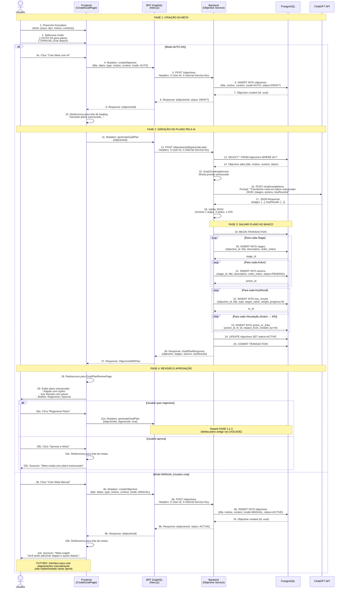
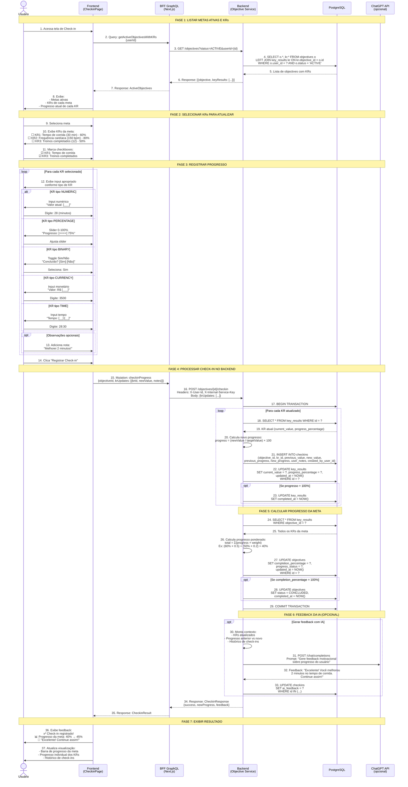

# 📊 Diagramas de Sequência - Módulo Goals

**Arquiteto:** Arquiobaldo  
**Data:** 08/11/2025  
**Contexto:** PRD 001 (Goal Chunking) + PRD 002 (Check-in de Progresso)

---

## 🎯 Diagrama 1: Criação de Meta com IA (Goal Chunking)

### **Fluxo Completo: PRD 001**



---

## 📊 Diagrama 2: Check-in de Progresso (Atualização de KRs)

### **Fluxo Completo: PRD 002**



---

## 📋 **ANÁLISE DOS DIAGRAMAS**

### **Diagrama 1 - Goal Chunking (PRD 001)**

**2 Fluxos Identificados:**

#### **Fluxo A: Modo AUTO (IA gera plano)**
1. ✅ **Criação da Meta** - Frontend → BFF → Backend → DB (mode=AUTO, status=DRAFT)
2. ✅ **Geração do Plano pela IA** - Backend → ChatGPT → Parsing
3. ✅ **Salvar Plano no Banco** - Transaction com stages, actions, key_results, action_kr_links
4. ✅ **Revisão e Aprovação** - Frontend exibe plano, usuário aprova ou regenera
5. ✅ **Ativação** - status=DRAFT → status=ACTIVE

#### **Fluxo B: Modo MANUAL (Usuário cria depois)**
1. ✅ **Criação da Meta** - Frontend → BFF → Backend → DB (mode=MANUAL, status=ACTIVE)
2. ✅ **Meta criada SEM plano** - Apenas objective, sem stages/actions/KRs
3. ⏸️ **Interface Manual (FUTURO)** - Usuário cria etapas/ações depois
4. ⏸️ **Não implementado nesta Sprint** - Foco em modo AUTO

**Pontos Críticos:**
- **Modo AUTO:** Meta criada com `status=DRAFT` → gera plano → aprova → `status=ACTIVE`
- **Modo MANUAL:** Meta criada com `status=ACTIVE` → SEM plano (stages/actions/KRs vazios)
- Plano gerado em transação (tudo ou nada)
- Vinculações action ↔ KR criadas automaticamente pela IA
- Regenerar = deletar plano antigo (CASCADE) + gerar novo

---

### **Diagrama 2 - Check-in (PRD 002)**

**Fases Identificadas:**
1. ✅ **Listar Metas Ativas e KRs** - Query com JOIN
2. ✅ **Selecionar KRs para Atualizar** - Usuário escolhe quais KRs
3. ✅ **Registrar Progresso** - Input apropriado por tipo de KR
4. ✅ **Processar Check-in no Backend** - Transaction com checkins + update key_results
5. ✅ **Calcular Progresso da Meta** - Progresso ponderado (Σ progress × weight)
6. ✅ **Feedback da IA (Opcional)** - ChatGPT gera feedback motivacional
7. ✅ **Exibir Resultado** - Frontend atualiza visualização

**Pontos Críticos:**
- Check-in registra histórico imutável (tabela `checkins`)
- Progresso calculado: `(newValue / targetValue) × 100`
- Progresso da meta: média ponderada dos KRs
- Feedback da IA é opcional (pode ser assíncrono)

---

## 🚨 **DESCOBERTAS IMPORTANTES**

### **1. Status da Meta (Objective)**

**PRD 001 sugere:**
- Meta criada com `status=DRAFT` (antes de gerar plano)
- Após gerar plano: `status=ACTIVE`

**Problema:**
- Tabela `objectives` atual tem `status`: ACTIVE, CONCLUDED, ARCHIVED
- **NÃO TEM `DRAFT`!**

**Opções:**

**Opção A: Adicionar DRAFT ao enum Status**
```sql
-- Migration V031
ALTER TABLE objectives DROP CONSTRAINT IF EXISTS chk_status;
ALTER TABLE objectives ADD CONSTRAINT chk_status 
    CHECK (status IN ('DRAFT', 'ACTIVE', 'CONCLUDED', 'ARCHIVED'));
```
- ✅ Segue PRD 001 fielmente
- ✅ Separa meta em criação (DRAFT) de meta ativa (ACTIVE)
- ❌ Altera enum existente (pode impactar código)

**Opção B: Usar ACTIVE para ambos**
- Modo AUTO: criar como ACTIVE, gerar plano, manter ACTIVE
- Modo MANUAL: criar como ACTIVE, sem plano
- ✅ Não altera enum existente
- ✅ Mais simples
- ❌ Não diferencia meta em criação de meta ativa

**Opção C: Usar campo separado (has_plan)**
- Adicionar campo `has_plan: BOOLEAN` em objectives
- Modo AUTO: has_plan=false → gera plano → has_plan=true
- Modo MANUAL: has_plan=false (sem plano)
- ✅ Não altera enum
- ✅ Indica se meta tem plano gerado
- ❌ Campo adicional

**DECISÃO NECESSÁRIA: Eduardo, qual opção você prefere?**

---

### **2. Ordem de Criação (Goal Chunking)**

**PRD 001 sugere:**
1. Criar Objective (DRAFT)
2. Gerar plano com IA
3. Salvar stages, actions, key_results, action_kr_links
4. Ativar meta (ACTIVE)

**Card 035 atual propõe:**
- Endpoint `POST /objectives/{id}/generate-plan`
- Assume que Objective já existe

**Isso está correto!** ✅

---

### **3. Tipos de Input por KR (Check-in)**

**PRD 002 especifica:**
- NUMERIC: input numérico
- PERCENTAGE: slider 0-100%
- BINARY: toggle Sim/Não
- CURRENCY: input monetário
- TIME: input tempo

**Frontend precisa:**
- Renderizar input apropriado por tipo
- Validar valores (ex: PERCENTAGE 0-100)

---

### **4. Cálculo de Progresso (Check-in)**

**PRD 002 especifica:**
- Progresso do KR: `(currentValue / targetValue) × 100`
- Progresso da meta: `Σ(progressKR × weight)`

**Exemplo:**
```
KR1: 60% × 0.50 = 30%
KR2: 80% × 0.30 = 24%
KR3: 50% × 0.20 = 10%
Total: 30% + 24% + 10% = 64%
```

**Backend precisa:**
- Calcular progresso de cada KR atualizado
- Recalcular progresso total da meta
- Atualizar `completion_percentage` em objectives

---

## ✅ **CARDS PRECISAM SER AJUSTADOS?**

### **Card 035 (Backend - Goal Chunking):**

**Ajustes Necessários:**
1. ✅ Adicionar discussão sobre `status=DRAFT` vs `ACTIVE`
2. ✅ Clarificar que endpoint assume Objective já existe
3. ✅ Especificar transação (tudo ou nada)
4. ✅ Especificar que regenerate deleta plano antigo (CASCADE)

**Está 90% correto!** Apenas precisa de clarificações.

---

### **Card 036 (BFF - Goal Chunking):**

**Ainda não criado.**

**Deve incluir:**
- Mutation `createObjective` (criar meta)
- Mutation `generateGoalPlan` (gerar plano)
- Query `getGoalWithPlan` (buscar meta com plano)
- Tratamento de status DRAFT vs ACTIVE

---

### **Card 037 (Frontend - Goal Chunking):**

**Ainda não criado.**

**Deve incluir:**
- CreateGoalPage (campos motive, context, mode)
- Fluxo: criar meta → gerar plano → revisar → aprovar
- GoalPlanReviewPage (visualização + aprovação)

---

### **Cards Futuros (Check-in):**

**Card 038 (Backend - Check-in):**
- Endpoint `POST /objectives/{id}/checkin`
- Salvar em `checkins` (histórico)
- Atualizar `key_results` (current_value, progress_percentage)
- Calcular progresso da meta (ponderado)
- Feedback da IA (opcional)

**Card 039 (BFF - Check-in):**
- Mutation `checkinProgress`
- Query `getActiveObjectivesWithKRs`

**Card 040 (Frontend - Check-in):**
- CheckinPage (listar metas + KRs)
- Inputs apropriados por tipo de KR
- Feedback visual de progresso

---

## 🎯 **PRÓXIMOS PASSOS**

**Eduardo, baseado nos diagramas:**

1. ✅ **Revisar Card 035** (Backend - Goal Chunking)?
   - Adicionar clarificações sobre status, transação, regenerate

2. ✅ **Criar Card 036** (BFF - Goal Chunking)?
   - Mutations: createObjective, generateGoalPlan
   - Query: getGoalWithPlan

3. ✅ **Criar Card 037** (Frontend - Goal Chunking)?
   - CreateGoalPage + GoalPlanReviewPage

4. ⏸️ **Deixar Check-in para depois?**
   - Cards 038-040 (Backend + BFF + Frontend)

**O que você prefere fazer agora?** 🤔

---

**Data de Criação:** 08/11/2025  
**Criado por:** Arquiobaldo (Arquiteto MoverseMais)  
**Contexto:** Análise de PRD 001 e PRD 002  
**Versão:** 1.0

